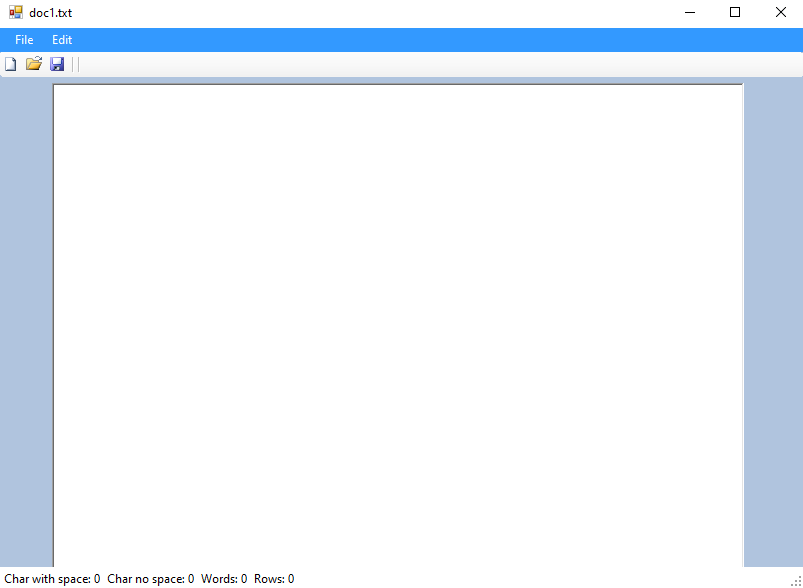

# textEditor
A text editor written in c#.net for a university course.

Basic functionality such as:
- Open and save new/exsisting files.
- Makes sure to check for unsaved changes
- Count words, rows and characters in document (real-time)
- Drag and drop text files into the window.

  

